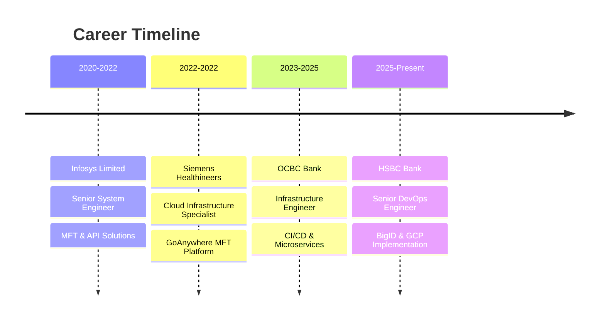

# 🌊 Niharika Dubey | Infrastructure & DevOps Engineer
  
<!-- Typing Animation -->


</div>

---

## 🚀 **About Me**


```yaml
name: "Niharika Dubey"
role: "Infrastructure & DevOps Engineer"
experience: "6+ Years"
location: "India"
focus:
  - Cloud Architecture (AWS, Azure)
  - DevOps Automation & CI/CD
  - Secure File Transfer Solutions
  - Kubernetes & Container Orchestration
  - Infrastructure as Code
  - Monitoring & Observability

current_company: "HSBC Bank"
previous: ["OCBC Bank", "Siemens Healthineers", "Infosys Limited"]

expertise:
  security: ["Enterprise Security", "Compliance Standards"]
  automation: ["Jenkins", "GitHub Actions", "Terraform"]
  monitoring: ["Prometheus", "Grafana", "ELK Stack"]
  
fun_fact: "I turn complex infrastructure into simple, scalable solutions! 🛠️"
```

---

## 🛠️ **Tech Arsenal**

<div align="center">

### **☁️ Cloud & Infrastructure**


### **🔧 DevOps & Automation**


### **📊 Monitoring & Observability**


### **💻 Languages & Scripting**


### **🔐 Security & File Transfer**


</div>

---

## 🎯 **Professional Journey**

<div align="center">



</div>

---

## 🏆 **Featured Projects**

<div align="center">

| 🚀 **Project** | 🛠️ **Tech Stack** | 📝 **Description** |
|:---:|:---:|:---:|
| **NoteVault** |    | Automated CI/CD pipeline with SonarQube & OWASP security scanning |
| **SecureScan** |   | DevSecOps implementation with CBOM/SBOM analysis |
| **BigID Pipeline** |   | Enterprise data governance automation |

</div>

---

## 📊 **GitHub Analytics**

<div align="center">


</div>

<div align="center">
  


</div>

---

## 🏅 **GitHub Achievements**

<div align="center">

<!--START_SECTION:waka-->


</div>

---

## 📈 **Weekly Development Breakdown**

```text
💼 Current Focus Areas:
🔥 BigID Implementation         █████████████████████░   84% 
☁️ GCP Infrastructure          ██████████████░░░░░░░   68%
🔐 Security Automation         ████████████░░░░░░░░░   60%
📊 ELK Stack Integration       ███████████░░░░░░░░░░   55%
🚀 Helm Charts Development     ████████░░░░░░░░░░░░░   40%

📅 Most Productive Day: Thursday (39.56% of commits)
🕐 Peak Hours: Daytime (37.36% of activity)
🎯 Primary Language: Python (40% of repositories)
📍 Time Zone: Asia/Kolkata
```
<!--END_SECTION:waka-->

---

## 🌐 **Connect & Collaborate**

<div align="center">

[](https://www.linkedin.com/in/nihharikadubey)
[](https://github.com/nihharikadubey)
[](mailto:niharika859@gmail.com)
[](https://yourportfolio.com)

</div>

---

<div align="center">

### 💡 **"Turning complex infrastructure challenges into elegant, scalable solutions"**


<!-- Animated Footer -->


</div>

---

<div align="center">
<i>⭐ Star my repositories if you find them useful! Let's build amazing infrastructure together! 🚀</i>
</div>
